<!-- ====================== BANNER ANIMADO (Nimbus Mono PS + cores GREI) ====================== -->
<div align="center">




</div>

<!-- ====================== SOBRE MIM ====================== -->
## ⚡ Sobre mim

```julia
struct Engenheiro_Eletricista
    nome::String
    universidade::String
    foco::Vector{String}
    grupo_pesquisa::String
end

douglas = Engenheiro_Eletricista(
    "Douglas Barros",
    "Universidade Federal do Ceará (UFC)",
    ["Sistemas Elétricos de Potência", "Smart Grids", "Co-simulação"],
    "GREI – Grupo de Redes Inteligentes"
)
```

- 🎓 Graduando em **Engenharia Elétrica (UFC)**
- 🔬 Bolsista **PIBIC** no **GREI – Grupo de Redes Inteligentes**
- ⚡ Pesquiso **Sistemas Elétricos de Potência**, **Redes Inteligentes** e **Co-simulação de Sistemas Multiagente**
- 🧮 Modelo redes com **OpenDSS** (`py_dss_interface`), agentes com **PADE** e co-simulação com **Mosaik** e **OMNeT++**
- 📍 Fortaleza/CE — Brasil

<!-- ====================== STACK (ÍCONES CLICÁVEIS) ====================== -->
## 🛠️ Tecnologias & Ferramentas

#### Linguagens
<a href="https://www.python.org" target="_blank"></a>
<a href="https://julialang.org" target="_blank"></a>
<a href="https://isocpp.org" target="_blank"></a>

#### Simulação & Sistemas de Potência
<a href="https://sourceforge.net/projects/electricdss/" target="_blank"></a>
<a href="https://py-dss-interface.readthedocs.io/en/latest/#" target="_blank"></a>
<a href="https://mosaik.offis.de" target="_blank"></a>
<a href="https://omnetpp.org" target="_blank"></a>
<a href="https://pade.readthedocs.io/pt-br/latest/" target="_blank"></a>

#### Ambiente
<a href="https://www.kernel.org" target="_blank"></a>
<a href="https://git-scm.com" target="_blank"></a>
<a href="https://code.visualstudio.com" target="_blank"></a>
<a href="https://jupyter.org" target="_blank"></a>

<!-- ====================== ESTATÍSTICAS ====================== -->
## 📊 Estatísticas do GitHub

<div align="center">


</div>

<div align="center">


</div>

<!-- ====================== SNAKE (cores GREI) ====================== -->
## 🐍 Atividade de contribuições

<div align="center">


</div>

<!-- ====================== CONTATO ====================== -->
## 🌐 Onde me encontrar

<div align="center">

<a href="https://www.linkedin.com/in/douglas-barros-a2252a225/" target="_blank"></a>
<a href="https://www.instagram.com/douglas.fdbs/" target="_blank"></a>

</div>

<div align="center">

</div>
